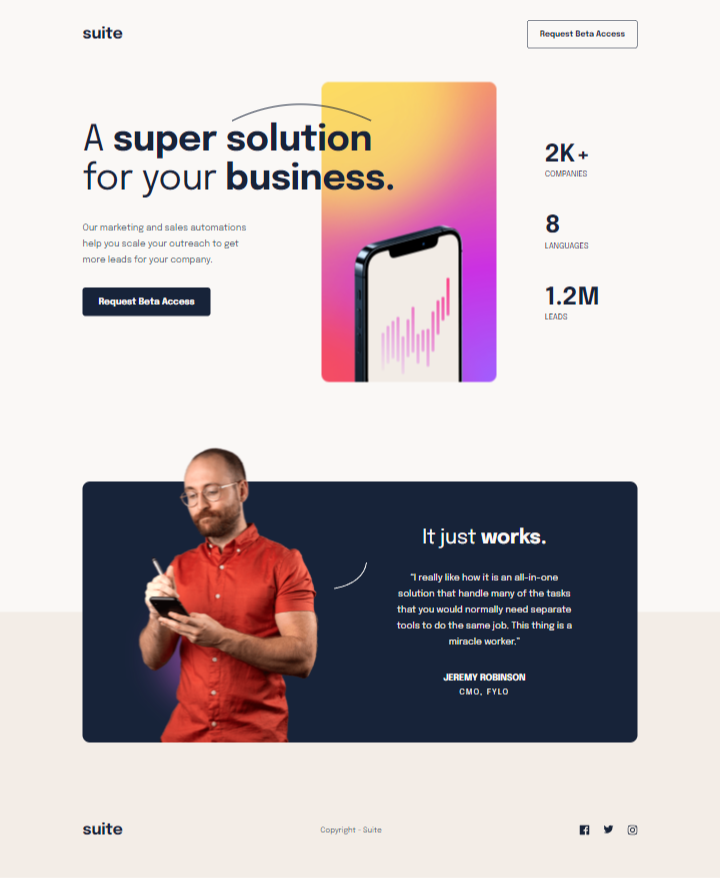

### The challenge

Users should be able to:

- Your users should be able to:
  -- View the optimal layout depending on their device's screen size
  -- See hover states for interactive elements

### Screenshot

### Links

- [Live](https://suite-landingpage.netlify.app/)
- [Solution](https://www.frontendmentor.io/solutions/tailwind-react-Wn_ZSfU9N)

### Built with

- HTML5
- CSS3
- Tailwind-css
- React

## Author

- Frontend Mentor - [@Henryzheng](https://www.frontendmentor.io/profile/LonelyBuddy)
